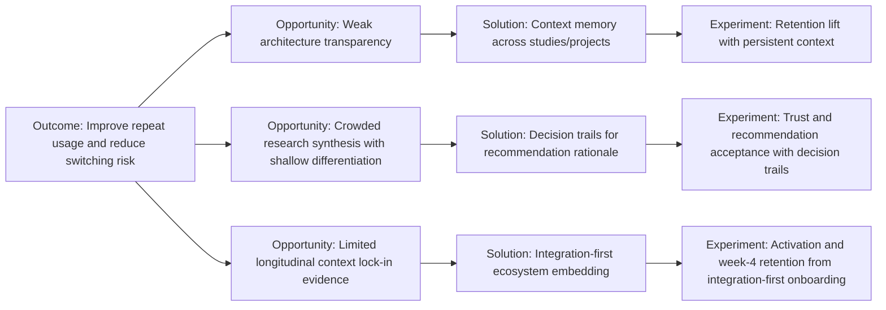

# AI Design Tooling 2026: Actionable Insights

This companion report turns the main analysis into execution-ready decisions.

## 1. Actionable Insights
- Most defensibility signals are execution-led, not model-led.
- Prioritize workflow ownership where team context accumulates over time.
- Avoid treating "AI feature count" as a moat signal without retention or switching-cost evidence.

## 2. Opportunity Solution Tree (OST)

### Opportunity
Increase defensibility and decision quality in AI design/research workflows.

### Outcome
Improve repeat usage and reduce switching risk for core team workflows.

### Opportunity Nodes
- Weak architecture transparency across competitors.
- Crowded research synthesis segment with shallow differentiation.
- Limited evidence of longitudinal context lock-in.

### Candidate Solutions
- Add context memory across studies/projects with explicit retrieval UX.
- Build workflow-native decision trails (why a recommendation was made).
- Strengthen ecosystem embedding (exports, sync, and downstream integrations).

### Experiments
- Compare retention and repeat task completion with/without persistent context memory.
- Test whether decision-trail visibility increases trust and acceptance of recommendations.
- Test if integration-first onboarding reduces time-to-value and churn risk.

## 3. Core Assumptions
- Teams value continuity of context more than one-off generation quality.
- Workflow depth and integration quality create stronger switching costs than standalone AI features.
- Better transparency (even partial) improves confidence and adoption in research decisions.

## 4. Current Gaps
- No direct user-level evidence in this repo for retention drivers.
- Limited architecture disclosures constrain confidence in hard-moat claims.
- Competitive benchmarks are snapshot-based, not longitudinal.
- No quantified test backlog tied to expected business impact.

## 5. What to Test Next
1. Persistence test: measure repeat usage lift from longitudinal context memory.
2. Trust test: measure recommendation acceptance with and without transparent decision trails.
3. Integration test: measure activation and week-4 retention for integration-first onboarding.
4. Differentiation test: compare switching intent before/after introducing workflow lock-in features.
5. Evidence quality test: track confidence score changes as new citations are added.

## 6. Success Metrics
- Weekly active team usage on recurring workflows.
- Week-4 and week-8 retention for research/design teams.
- Recommendation acceptance rate in synthesis workflows.
- Time-to-value for first integrated workflow completion.
- Self-reported switching difficulty over time.
